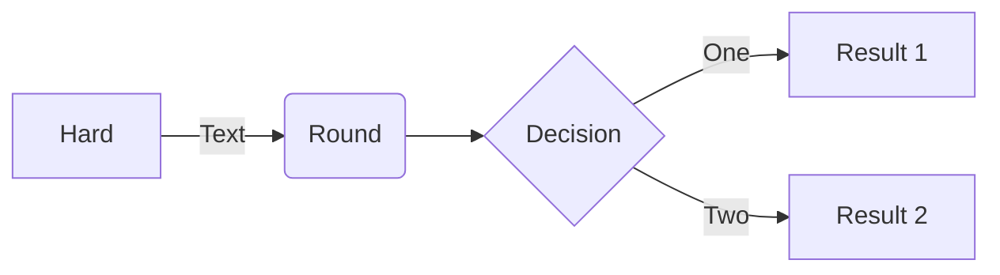
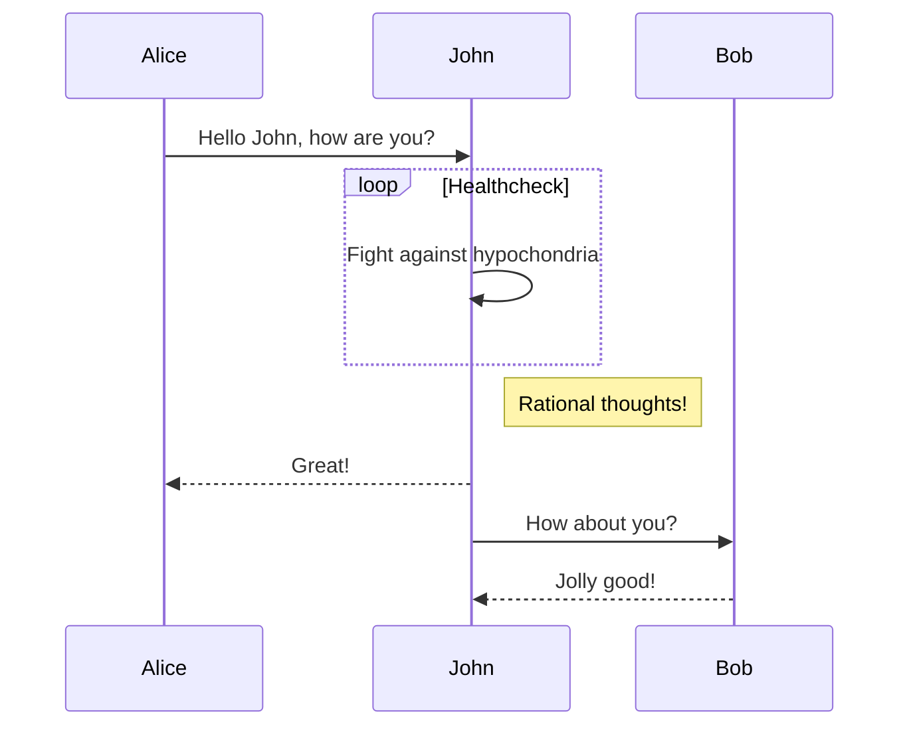
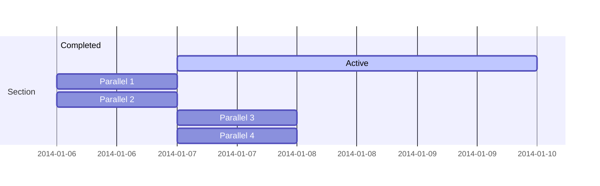
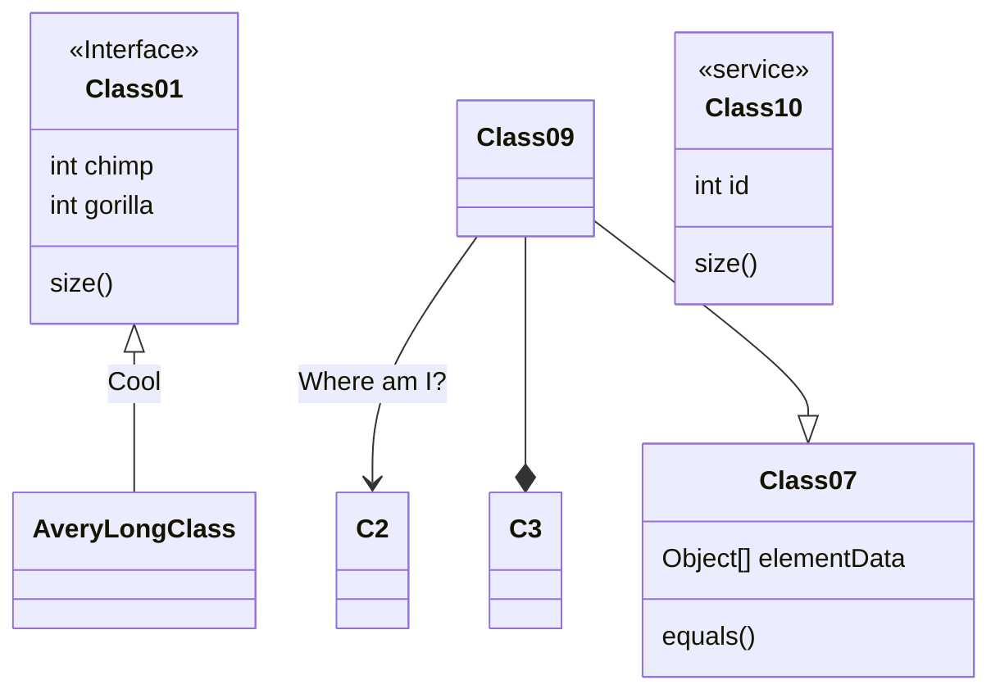
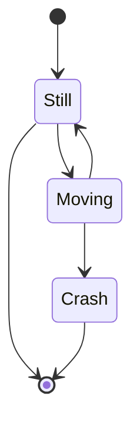
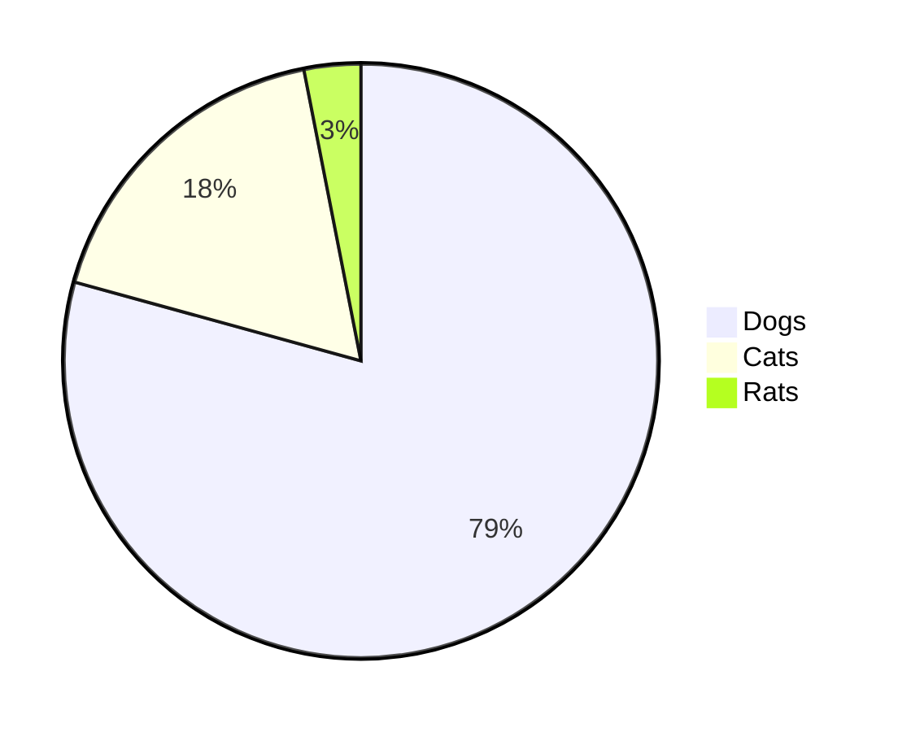
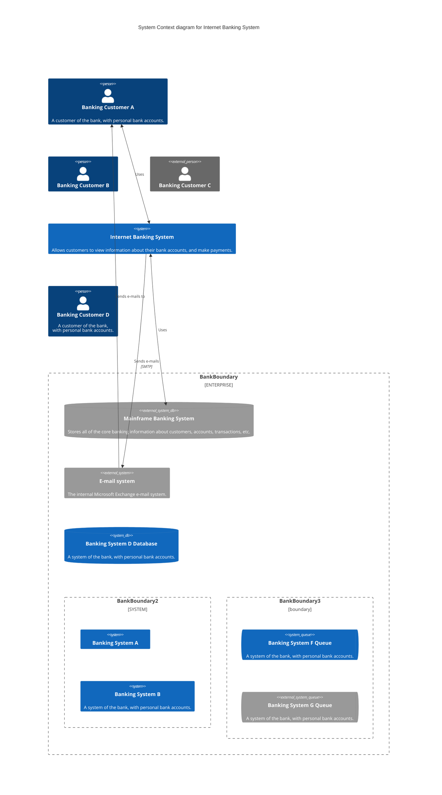

Next.jsでSSG時にRemarkでMermaidをSVGにして出力してみたいと思うこと、ありますよね。  
僕はあるのですがネット上にあまり情報が無かったので自分用にメモです。

今回は`remark-mermaidjs`を使って実装しました。

このサイトではMarkdownを`unified`で扱っているので`remark-mermaidjs`を`use`します。  
`remark-mermaidjs`はGoogle Chromeを使ってMermaidをSVGにしているらしく`executablePath`でGoogle Chromeのパスを指定しなければならないようです。  
このサイトはGitHub Actionsでビルドしているので、ubuntuのために`/opt/google/chrome/google-chrome`を指定しました。なお、ローカル環境でも自由に動かせるように`.env`にもGoogle Chromeへのパスを書くことにしました。

```typescript
// @ts-ignore
import rehypePrism from '@mapbox/rehype-prism';
import rehypeKatex from 'rehype-katex';
import rehypeStringify from 'rehype-stringify';
import remarkGfm from 'remark-gfm';
import remarkMath from 'remark-math';
import remarkMermaid from 'remark-mermaidjs';
import remarkParse from 'remark-parse';
import remarkRehype from 'remark-rehype';
import { unified } from 'unified';

export const markdownToHtml = async (markdown: string) =>
	(
		await unified()
			.use(remarkParse)
			.use(remarkMath)
			.use(remarkGfm)
			.use(remarkMermaid, {
				launchOptions: {
					executablePath:
						process.env.GoogleChromeExecutablePath ?? // .env
						'/opt/google/chrome/google-chrome', // for GitHub Actions Ubuntu
				},
				svgo: false,
			})
			.use(remarkRehype, { allowDangerousHtml: true, footnoteLabel: '脚注' })
			.use(rehypePrism)
			.use(rehypeKatex)
			.use(rehypeStringify, { allowDangerousHtml: true })
			.process(markdown)
	)
		.toString()
		.replace(/@@baseUrl@@/g, process.env.baseUrl || '');
```

以下にサンプルを置いておきます。図がSVGになっていることがわかると思います。

## Flowchart

````markdown

````


## Sequence diagram

````markdown

````


## Gantt chart

````markdown

````


## Class diagram

````markdown

````


## State diagram

````markdown

````


## Pie chart

````markdown

````


## C4 diagram

````markdown

````

````mermaid
C4Context
title System Context diagram for Internet Banking System

Person(customerA, "Banking Customer A", "A customer of the bank, with personal bank accounts.")
Person(customerB, "Banking Customer B")
Person_Ext(customerC, "Banking Customer C")
System(SystemAA, "Internet Banking System", "Allows customers to view information about their bank accounts, and make payments.")

Person(customerD, "Banking Customer D", "A customer of the bank, <br/> with personal bank accounts.")

Enterprise_Boundary(b1, "BankBoundary") {

  SystemDb_Ext(SystemE, "Mainframe Banking System", "Stores all of the core banking information about customers, accounts, transactions, etc.")

  System_Boundary(b2, "BankBoundary2") {
    System(SystemA, "Banking System A")
    System(SystemB, "Banking System B", "A system of the bank, with personal bank accounts.")
  }

  System_Ext(SystemC, "E-mail system", "The internal Microsoft Exchange e-mail system.")
  SystemDb(SystemD, "Banking System D Database", "A system of the bank, with personal bank accounts.")

  Boundary(b3, "BankBoundary3", "boundary") {
    SystemQueue(SystemF, "Banking System F Queue", "A system of the bank, with personal bank accounts.")
    SystemQueue_Ext(SystemG, "Banking System G Queue", "A system of the bank, with personal bank accounts.")
  }
}

BiRel(customerA, SystemAA, "Uses")
BiRel(SystemAA, SystemE, "Uses")
Rel(SystemAA, SystemC, "Sends e-mails", "SMTP")
Rel(SystemC, customerA, "Sends e-mails to")
````

Mermaid記法なら簡単にグラフを書けて便利なので、どんどん使っていきたいと思います。
