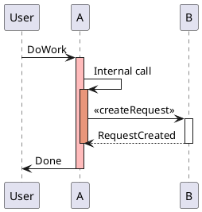
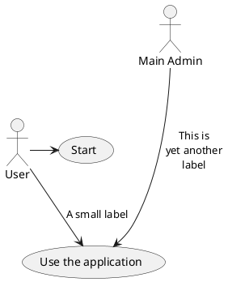
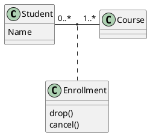
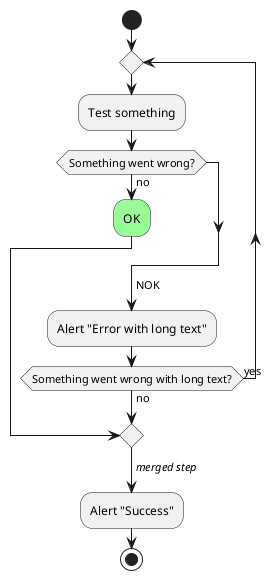
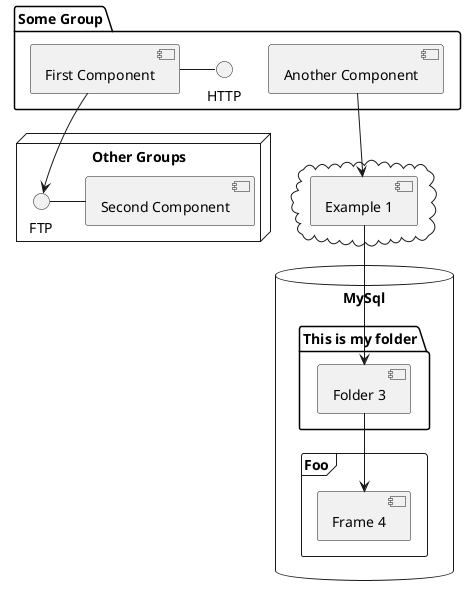
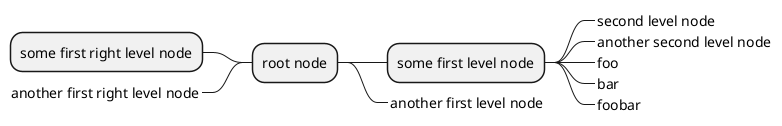
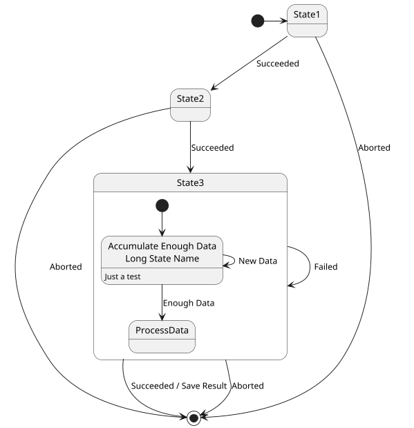
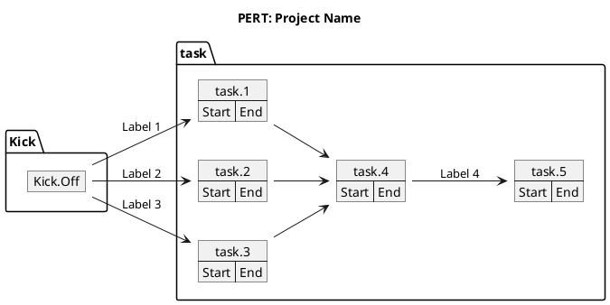
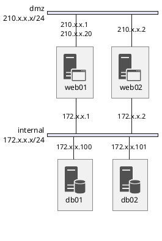

Next.jsでSSG時にRemarkでPlantUMLで書いたAWSのアーキテクチャ図をSVGにして出力してみたいと思うこと、ありますよね。  
僕はあるのですがネット上にあまり情報が無かったので自分用にメモです。

今回は`remark-sync-plantuml`を使って実装しました。

このサイトではMarkdownを`unified`で扱っているので`remark-sync-plantuml`を`use`します。  
`remark-sync-plantuml`はjavaでplantuml.jarを使ってMermaidをSVGにしているらしく、このサイトはGitHub Actionsでビルドしているので問題なく動かせそうなので採用しました。

```typescript
import rehypeShiki from '@leafac/rehype-shiki';
import rehypeKatex from 'rehype-katex';
import rehypeStringify from 'rehype-stringify';
import remarkGfm from 'remark-gfm';
import remarkMath from 'remark-math';
import remarkMermaid from 'remark-mermaidjs';
import remarkParse from 'remark-parse';
import remarkRehype from 'remark-rehype';
import remarkPlantUML from 'remark-sync-plantuml';
import { getHighlighter } from 'shiki';
import { unified } from 'unified';

export const markdownToHtml = async (markdown: string) =>
	(
		await unified()
			.use(remarkParse)
			.use(remarkMath)
			.use(remarkGfm)
			.use(remarkMermaid, {
				launchOptions: {
					executablePath:
						process.env.GoogleChromeExecutablePath ??
						'/opt/google/chrome/google-chrome',
				},
				svgo: false,
			})
			.use(remarkPlantUML)
			.use(remarkRehype, {
				allowDangerousHtml: true,
				footnoteLabel: '脚注',
			})
			.use(rehypeShiki, {
				highlighter: await getHighlighter({
					theme: 'github-light',
				}),
			})
			.use(rehypeKatex)
			.use(rehypeStringify, { allowDangerousHtml: true })
			.process(markdown)
	)
		.toString();

```

以下にサンプルを置いておきます。図がSVGになっていることがわかると思います。

## AWS Architecture Diagrams

AWSが<https://github.com/awslabs/aws-icons-for-plantuml>で公開しているAWS Icons for PlantUMLも使うことができます。  
これなら簡単にAWSのアーキテクチャ図を書くことができて便利です。

````markdown
```plantuml
@startuml
skinparam svgDimensionStyle false
skinparam defaultFontName Noto Sans CJK JP Black Regular

'Copyright 2019 Amazon.com, Inc. or its affiliates. All Rights Reserved.
'SPDX-License-Identifier: MIT (For details, see https://github.com/awslabs/aws-icons-for-plantuml/blob/master/LICENSE)

!define AWSPuml https://raw.githubusercontent.com/awslabs/aws-icons-for-plantuml/v15.0/dist

!include AWSPuml/AWSCommon.puml
!include AWSPuml/AWSExperimental.puml
!include AWSPuml/Groups/all.puml
!include AWSPuml/Compute/LambdaLambdaFunction.puml
!include AWSPuml/General/Documents.puml
!include AWSPuml/General/Multimedia.puml
!include AWSPuml/General/Tapestorage.puml
!include AWSPuml/General/User.puml
!include AWSPuml/MediaServices/ElementalMediaConvert.puml
!include AWSPuml/MachineLearning/Transcribe.puml
!include AWSPuml/Storage/SimpleStorageService.puml

' define custom group for Amazon S3 bucket
AWSGroupColoring(S3BucketGroup, #FFFFFF, AWS_COLOR_GREEN, plain)
!define S3BucketGroup(g_alias, g_label="Amazon S3 bucket") AWSGroupEntity(g_alias, g_label, AWS_COLOR_GREEN, SimpleStorageService, S3BucketGroup)

' Groups are rectangles with a custom style using stereotype - need to hide
hide stereotype
skinparam linetype ortho
skinparam rectangle {
		BackgroundColor AWS_BG_COLOR
		BorderColor transparent
}
'skinparam handwritten true
sprite Callout_1 <svg width="18" height="18"><circle cx="9" cy="9" r="9" fill="black" /><text x="5" y="13" fill="#FFFFFF" font-size="12">1</text></svg>

rectangle "$UserIMG()\nユーザー" as user
AWSCloudGroup(cloud){
	RegionGroup(region) {
		S3BucketGroup(s3) {
			rectangle "$MultimediaIMG()\n\t動画\t" as video
			rectangle "$TapestorageIMG()\n\t音声\t" as audio
			rectangle "$DocumentsIMG()\n\tテキスト\t" as transcript

			user -r-> video: <$Callout_1>\lアップロード
			video -r-> audio
			audio -r-> transcript
		}

		rectangle "$LambdaLambdaFunctionIMG()\nObjectCreated\nevent handler" as e1
		rectangle "$ElementalMediaConvertIMG()\nAWS Elemental\nMediaConvert" as mediaconvert
		rectangle "$TranscribeIMG()\nAmazon Transcribe\n" as transcribe

		video -d-> e1: <$Callout_2>
		e1 -[hidden]r-> mediaconvert
		mediaconvert -[hidden]r-> transcribe
		mediaconvert -u-> audio: <$Callout_3>
		transcribe -u-> transcript: <$Callout_4>

		StepFunctionsWorkflowGroup(sfw) {
			rectangle "$LambdaLambdaFunctionIMG()\nextract audio" as sfw1
			rectangle "$LambdaLambdaFunctionIMG()\ntranscribe audio" as sfw2

			e1 -r-> sfw1: 起動
			sfw1 -r-> sfw2
			sfw1 -u-> mediaconvert
			sfw2 -u-> transcribe
		}
	}
}
@enduml
```
````

```plantuml
@startuml
skinparam svgDimensionStyle false
skinparam defaultFontName Noto Sans CJK JP Black Regular

'Copyright 2019 Amazon.com, Inc. or its affiliates. All Rights Reserved.
'SPDX-License-Identifier: MIT (For details, see https://github.com/awslabs/aws-icons-for-plantuml/blob/master/LICENSE)

!define AWSPuml https://raw.githubusercontent.com/awslabs/aws-icons-for-plantuml/v15.0/dist

!include AWSPuml/AWSCommon.puml
!include AWSPuml/AWSExperimental.puml
!include AWSPuml/Groups/all.puml
!include AWSPuml/Compute/LambdaLambdaFunction.puml
!include AWSPuml/General/Documents.puml
!include AWSPuml/General/Multimedia.puml
!include AWSPuml/General/Tapestorage.puml
!include AWSPuml/General/User.puml
!include AWSPuml/MediaServices/ElementalMediaConvert.puml
!include AWSPuml/MachineLearning/Transcribe.puml
!include AWSPuml/Storage/SimpleStorageService.puml

' define custom group for Amazon S3 bucket
AWSGroupColoring(S3BucketGroup, #FFFFFF, AWS_COLOR_GREEN, plain)
!define S3BucketGroup(g_alias, g_label="Amazon S3 bucket") AWSGroupEntity(g_alias, g_label, AWS_COLOR_GREEN, SimpleStorageService, S3BucketGroup)

' Groups are rectangles with a custom style using stereotype - need to hide
hide stereotype
skinparam linetype ortho
skinparam rectangle {
		BackgroundColor AWS_BG_COLOR
		BorderColor transparent
}
'skinparam handwritten true
sprite Callout_1 <svg width="18" height="18"><circle cx="9" cy="9" r="9" fill="black" /><text x="5" y="13" fill="#FFFFFF" font-size="12">1</text></svg>

rectangle "$UserIMG()\nユーザー" as user
AWSCloudGroup(cloud){
	RegionGroup(region) {
		S3BucketGroup(s3) {
			rectangle "$MultimediaIMG()\n\t動画\t" as video
			rectangle "$TapestorageIMG()\n\t音声\t" as audio
			rectangle "$DocumentsIMG()\n\tテキスト\t" as transcript

			user -r-> video: <$Callout_1>\lアップロード
			video -r-> audio
			audio -r-> transcript
		}

		rectangle "$LambdaLambdaFunctionIMG()\nObjectCreated\nevent handler" as e1
		rectangle "$ElementalMediaConvertIMG()\nAWS Elemental\nMediaConvert" as mediaconvert
		rectangle "$TranscribeIMG()\nAmazon Transcribe\n" as transcribe

		video -d-> e1: <$Callout_2>
		e1 -[hidden]r-> mediaconvert
		mediaconvert -[hidden]r-> transcribe
		mediaconvert -u-> audio: <$Callout_3>
		transcribe -u-> transcript: <$Callout_4>

		StepFunctionsWorkflowGroup(sfw) {
			rectangle "$LambdaLambdaFunctionIMG()\nextract audio" as sfw1
			rectangle "$LambdaLambdaFunctionIMG()\ntranscribe audio" as sfw2

			e1 -r-> sfw1: 起動
			sfw1 -r-> sfw2
			sfw1 -u-> mediaconvert
			sfw2 -u-> transcribe
		}
	}
}
@enduml
```

## 他のUML図

PlantUMLで書ける他のUML図の例も紹介しておきます。

### シーケンス図

````markdown

````


### ユースケース図

````markdown

````


### クラス図

````markdown

````


### アクティビティ図

````markdown

````


### コンポーネント図

````markdown

````


### マインドマップ図

````markdown

````


### 状態図

````markdown

````


### オブジェクト図

````markdown

````


### ネットワーク図

````markdown

````


### ガントチャート図

````markdown
```plantuml
@startgantt
skinparam svgDimensionStyle false
<style>
ganttDiagram {
	task {
		FontName Helvetica
		FontColor red
		FontSize 18
		FontStyle bold
		BackGroundColor GreenYellow
		LineColor blue
	}
	milestone {
		FontColor blue
		FontSize 25
		FontStyle italic
		BackGroundColor yellow
		LineColor red
	}
	note {
		FontColor DarkGreen
		FontSize 10
		LineColor OrangeRed
	}
	arrow {
		FontName Helvetica
		FontColor red
		FontSize 18
		FontStyle bold
		BackGroundColor GreenYellow
		LineColor blue
		LineStyle 8.0;13.0
		LineThickness 3.0
	}
	separator {
		BackgroundColor lightGreen
		LineStyle 8.0;3.0
		LineColor red
		LineThickness 1.0
		FontSize 16
		FontStyle bold
		FontColor purple
		Margin 5
		Padding 20
	}
	timeline {
	    BackgroundColor Bisque
	}
	closed {
		BackgroundColor pink
		FontColor red
	}
}
</style>
Project starts the 2020-12-01

[Task1] lasts 10 days
sunday are closed

note bottom
  memo1 ...
  memo2 ...
  explanations1 ...
  explanations2 ...
end note

[Task2] lasts 20 days
[Task2] starts 10 days after [Task1]'s end
-- Separator title --
[M1] happens on 5 days after [Task1]'s end

<style>
	separator {
	    LineColor black
		Margin 0
		Padding 0
	}
</style>

-- end --
@endgantt
```
````

```plantuml
@startgantt
skinparam svgDimensionStyle false
<style>
ganttDiagram {
	task {
		FontName Helvetica
		FontColor red
		FontSize 18
		FontStyle bold
		BackGroundColor GreenYellow
		LineColor blue
	}
	milestone {
		FontColor blue
		FontSize 25
		FontStyle italic
		BackGroundColor yellow
		LineColor red
	}
	note {
		FontColor DarkGreen
		FontSize 10
		LineColor OrangeRed
	}
	arrow {
		FontName Helvetica
		FontColor red
		FontSize 18
		FontStyle bold
		BackGroundColor GreenYellow
		LineColor blue
		LineStyle 8.0;13.0
		LineThickness 3.0
	}
	separator {
		BackgroundColor lightGreen
		LineStyle 8.0;3.0
		LineColor red
		LineThickness 1.0
		FontSize 16
		FontStyle bold
		FontColor purple
		Margin 5
		Padding 20
	}
	timeline {
	    BackgroundColor Bisque
	}
	closed {
		BackgroundColor pink
		FontColor red
	}
}
</style>
Project starts the 2020-12-01

[Task1] lasts 10 days
sunday are closed

note bottom
  memo1 ...
  memo2 ...
  explanations1 ...
  explanations2 ...
end note

[Task2] lasts 20 days
[Task2] starts 10 days after [Task1]'s end
-- Separator title --
[M1] happens on 5 days after [Task1]'s end

<style>
	separator {
	    LineColor black
		Margin 0
		Padding 0
	}
</style>

-- end --
@endgantt
```

PlantUML記法なら簡単にグラフを書けて便利なので、どんどん使っていきたいと思います。
